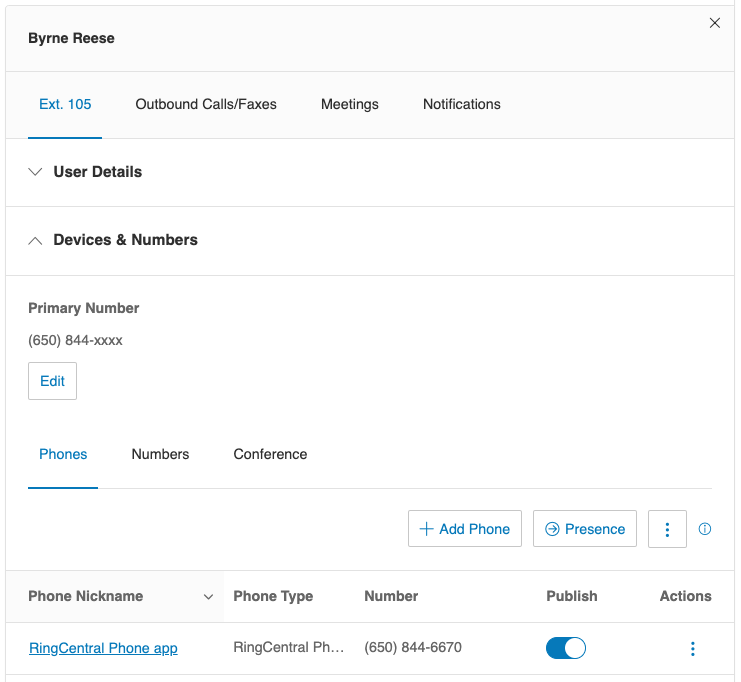
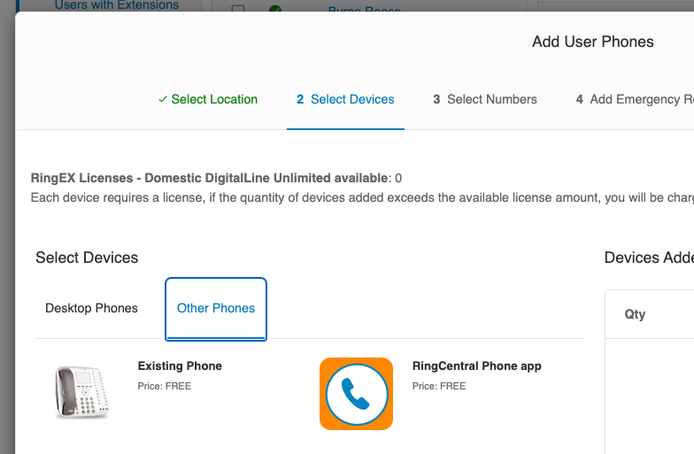
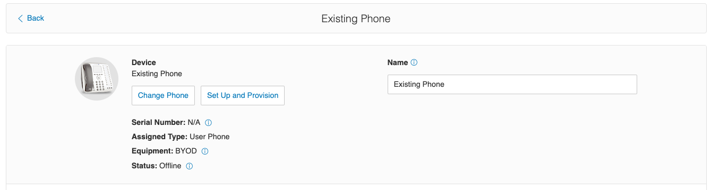
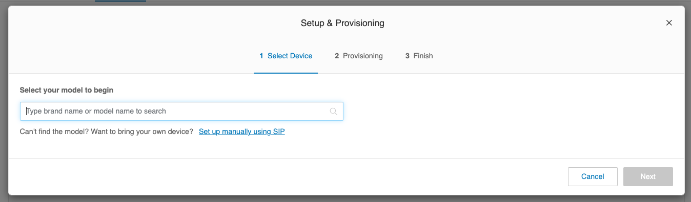
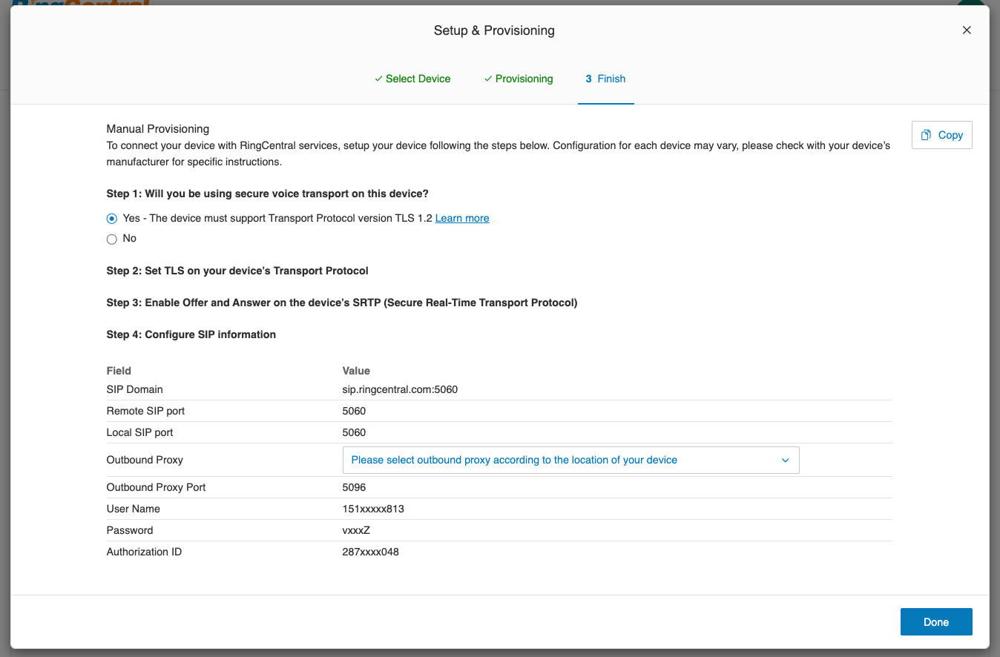

---
hide:
  - navigation
---
# Getting started with the Cloud Phone SDK

The primary task in getting started using the Cloud Phone SDK is to obtaining the necessary credentials and information for the Cloud Phone SDK to connect to your device.

## Install the SDK

The SDK is available from [npmjs](https://www.npmjs.com/package/ringcentral-softphone) and can be installed by the standard mechanisms. 

```
yarn install ringcentral-softphone
```

## Obtaining credentials

There are two ways to find the credentials needed to connect to a device using the Soft Phone SDK. You can navigate the RingCentral application and obtain credentials through our user interface, or you can fetch them programmatically via the API. 

### Using the Admin Portal to obtain credentials

1. Login to the RingCentral [Admin Portal](https://service.ringcentral.com)

2. Then, navigate to the user or extension that you will be binding the Cloud Phone SDK to. 

3. Expand the section called "Devices & Numbers"
    

4. In the list of phones found under "Devices & Numbers," select the device you want to use. 

    !!! warning "The phone type must be 'Existing Phone'"
	    If the user does not have a phone of this type, you may need to create one. The Cloud Phone SDK will not work with "RingCentral Desktop app" phone types. 
        

5. Click the "Set Up and Provision" button
    

6. Click the link "Set up manually using SIP"
    

On the resulting page you will find the following fields:

* SIP Domain
* Outbound Proxy
* User Name
* Password
* Authorization ID



!!! info "The SIP Domain's port number is not necessary to connect"
    On the credentials page you will observe that the "SIP Domain" field shows a port number. You can safely ignore this port number when connecting to a device.

### Obtaining Cloud Phone credentials via the API

Alternatively, you can obtain the connection and credential information you need via a RingCentral REST API.

*Please note: this technique requires familiarity with the RingCentral REST API. If you have never used this API, please consult our [getting started guide](https://developers.ringcentral.com/guide/getting-started).*

#### Find appropriate device

You will first need to obtain a list of devices for an extension using the [list extension devices](https://developers.ringcentral.com/api-reference/Devices/listExtensionDevices) endpoint. In the response you will find the devices type:

=== "List extension devices response (excerpt)"

```js hl_lines="6"
{
  "uri" : "https://platform.ringcentral.com/restapi/v1.0/account/1508191004/extension/1508193004/device?page=1&perPage=1",
  "records" : [ {
    "uri" : "https://platform.ringcentral.com/restapi/v1.0/account/1508191004/device/228113004",
    "id" : "228113004",
    "type" : "HardPhone",
    "sku" : "HP-37",
    "model" : {
      "id" : "37",
      "name" : "Polycom IP 6000 Conference Phone",
      "lineCount" : 2,
      "addons" : [ ],
      "features" : [ ]
    },
    "name" : "Polycom IP 6000 Conference Phone",
    "status" : "Offline",
	// truncated for brevity
  }]
}
```

!!! warning "Only 'Other Phone' types are supported by Cloud Phone SDK"
    As stated previously, not every device can be used with the Cloud Phone SDK. Only devices with a type of `Other Phone` are supported. Any other type will not work with the SDK.

!!! info "'Other Phone' type is equivalent to 'Existing Phone' as seen in Admin Portal"

If you cannot find an appropriate device via the API, then you will need to create a device manually. Please refer to [previous section](#using-the-admin-portal-to-obtain-credentials).

#### Read device info

Using the `id` of the selected device, call the [read device SIP info](https://developers.ringcentral.com/api-reference/Devices/readDeviceSipInfo) REST API. A response from this API has the following information you will need:

* `userName`
* `password`
* `authorizationId`
* `proxy`

=== "Read Device SIP Info Response"

```json hl_lines="3-5 8-10"
{
  "domain": "sip.ringcentral.com",
  "userName": "16501234567",
  "password": "password",
  "authorizationId": "802512345678",
  "outboundProxies": [
    {
      "region": "NA",
      "proxy": "sip20.ringcentral.com:5090",
      "proxyTLS": "sip20.ringcentral.com:5096"
    },
    {
      "region": "EMEA",
      "proxy": "sip40.ringcentral.com:5090",
      "proxyTLS": "sip40.ringcentral.com:5096"
    },
    {
      "region": "APAC",
      "proxy": "sip71.ringcentral.com:5090",
      "proxyTLS": "sip71.ringcentral.com:5096"
    },
    {
      "region": "LATAM",
      "proxy": "sip80.ringcentral.com:5090",
      "proxyTLS": "sip80.ringcentral.com:5096"
    }
    ...
  ]
}
```

[View demo source code](https://github.com/tylerlong/rc-get-device-info-demo/blob/main/src/demo.ts){ .md-button }

You will need to choose a outboundProxy value based on your location. And please choose the `proxyTLS` value because this SDK uses TLS. For example if you live in north America, choose `sip10.ringcentral.com:5096`.

## Initializing the SDK

Once you have [obtained your device's credentials](get-started.md), you can connect to the device and begin receiving events. 

```ts
import Softphone from "ringcentral-softphone";

const softphone = new Softphone({
  domain: process.env.SIP_DOMAIN,
  outboundProxy: process.env.SIP_OUTBOUND_PROXY,
  username: process.env.SIP_USERNAME,
  password: process.env.SIP_PASSWORD,
  authorizationId: process.env.SIP_AUTHORIZATION_ID
});
```

!!! info "Creating multiple instances with the same credentials"
    One can run multiple instances of a cloud phone using the same credentials without causing an error. However, only the most recently created instance will receive inbound calls.

