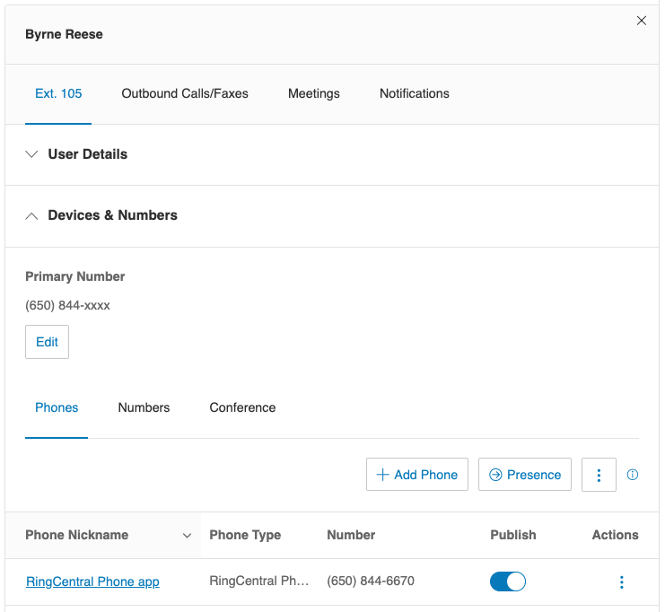
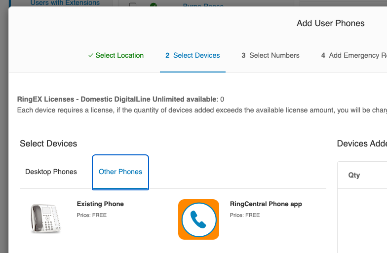
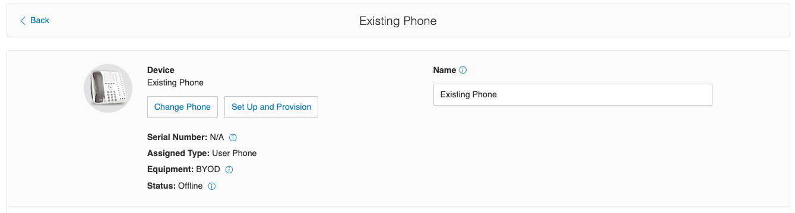
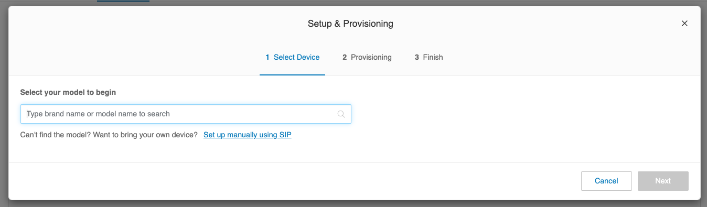
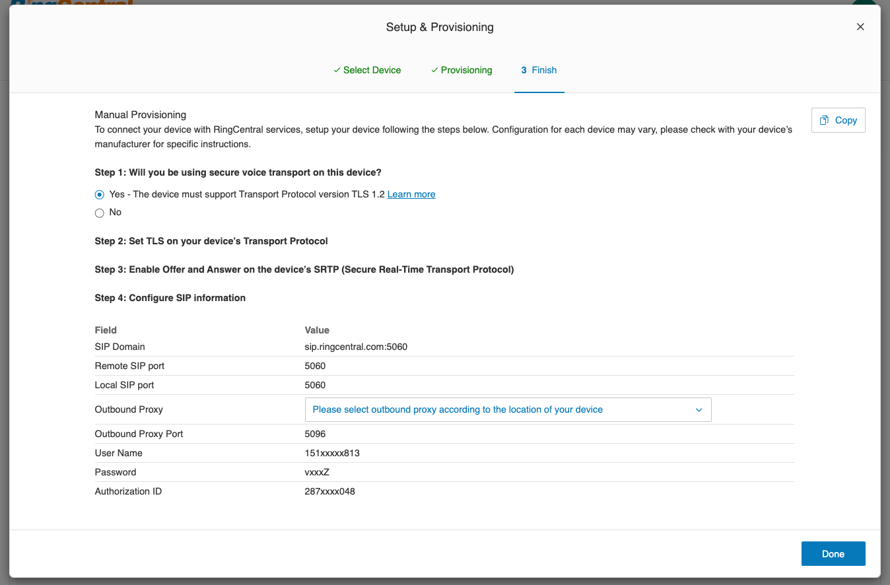

# Getting Started

## Install the SDK

=== "Yarn"

    ```bash
    yarn add ringcentral-softphone
    ```

=== "npm"

    ```bash
    npm install ringcentral-softphone
    ```

## Get SIP credentials from the web portal

You need an **Existing Phone** device for the user or extension that will place
and receive calls.

1. Sign in to the [RingCentral portal](https://service.ringcentral.com), open
   the user or extension, and expand **Devices & Numbers**.

   

2. Select an **Existing Phone** device, or create one if necessary. A
   RingCentral desktop or mobile app device cannot be used with this SDK.

   

3. Select **Set Up and Provision**.

   

4. Select **Set up manually using SIP**.

   

5. Copy the SIP domain, outbound proxy, username, password, and authorization
   ID.

   

Remove the port from the SIP domain: use `sip.ringcentral.com`, not
`sip.ringcentral.com:5061`. Keep the port in the outbound proxy.

## Get SIP credentials from the REST API

Use
[List Extension Devices](https://developers.ringcentral.com/api-reference/Devices/listExtensionDevices)
to find a device whose API `type` is `OtherPhone`. The API type `SoftPhone`
represents a RingCentral app device and cannot be used by this SDK.

Call
[Read Device SIP Information](https://developers.ringcentral.com/api-reference/Devices/readDeviceSipInfo)
for the selected device. Choose the `proxyTLS` value for the region nearest your
workload because the SDK connects over TLS:

```json
{
  "domain": "sip.ringcentral.com",
  "outboundProxies": [
    {
      "region": "NA",
      "proxy": "sip20.ringcentral.com:5090",
      "proxyTLS": "sip20.ringcentral.com:5096"
    }
  ],
  "userName": "16501234567",
  "password": "password",
  "authorizationId": "802512345678"
}
```

The
[credential lookup demo](https://github.com/tylerlong/rc-get-device-info-demo/blob/main/src/demo.ts)
shows the complete REST API flow.

## Configure and register

```ts
import Softphone from "ringcentral-softphone";

const softphone = new Softphone({
  domain: process.env.SIP_INFO_DOMAIN!,
  outboundProxy: process.env.SIP_INFO_OUTBOUND_PROXY!,
  username: process.env.SIP_INFO_USERNAME!,
  password: process.env.SIP_INFO_PASSWORD!,
  authorizationId: process.env.SIP_INFO_AUTHORIZATION_ID!,
});

softphone.on("invite", async (inviteMessage) => {
  const callSession = await softphone.answer(inviteMessage);
  callSession.once("disposed", () => console.log("Call ended"));
});

await softphone.register();
```

Attach the `invite` listener before registering so an inbound call cannot arrive
between registration and listener setup.

| Option | Required | Description |
| --- | --- | --- |
| `domain` | Yes | SIP domain without a port. |
| `outboundProxy` | Yes | Regional TLS proxy including its port. |
| `username` | Yes | SIP username. |
| `password` | Yes | SIP password. |
| `authorizationId` | Yes | SIP authorization ID. |
| `codec` | No | `OPUS/16000` (default), `OPUS/48000/2`, or `PCMU/8000`. |
| `ignoreTlsCertErrors` | No | Disable TLS certificate checks in a controlled development environment only. |

Types for options, invites, call sessions, outbound call sessions, and audio
streamers are available from the package root. Inline values are inferred, so
import these types only when a function or stored value needs an annotation:

```ts
import type {
  CallSession,
  InboundInvite,
  OutboundCallSession,
  SoftphoneOptions,
  Streamer,
} from "ringcentral-softphone";
```

Call `softphone.revoke()` when the application no longer needs the
registration.

## Debug registration

`register()` rejects when the initial registration fails. Listen for
`registrationError` to handle a later registration refresh failure:

```ts
softphone.on("registrationError", (error) => {
  console.error("Registration refresh failed", error);
});

softphone.enableDebugMode();
```

Custom prefixes help distinguish logs from multiple instances:

```ts
softphone.enableDebugMode({
  inboundPrefix: "Instance A receiving...\n",
  outboundPrefix: "Instance A sending...\n",
});
```

## TLS certificates

Certificate verification is enabled by default. Fix the certificate chain in
production. Set `ignoreTlsCertErrors: true` only in a trusted, controlled
development environment because it permits man-in-the-middle attacks.

Next, [answer or place a call](guides/call-control.md).
